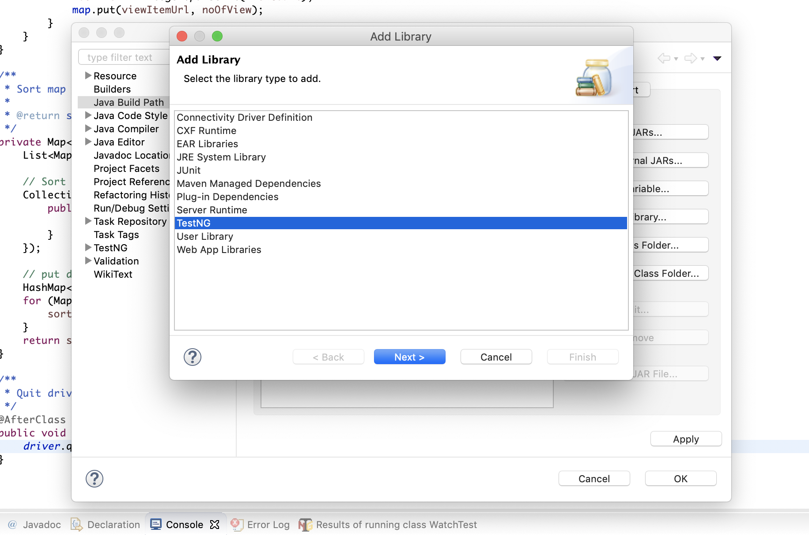
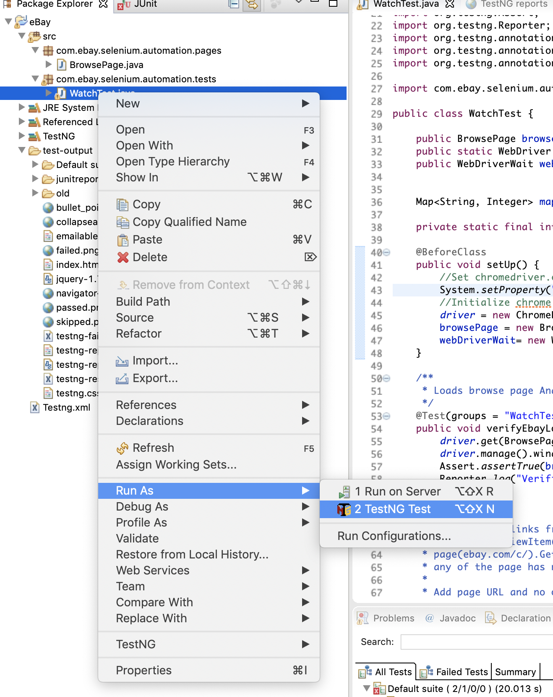
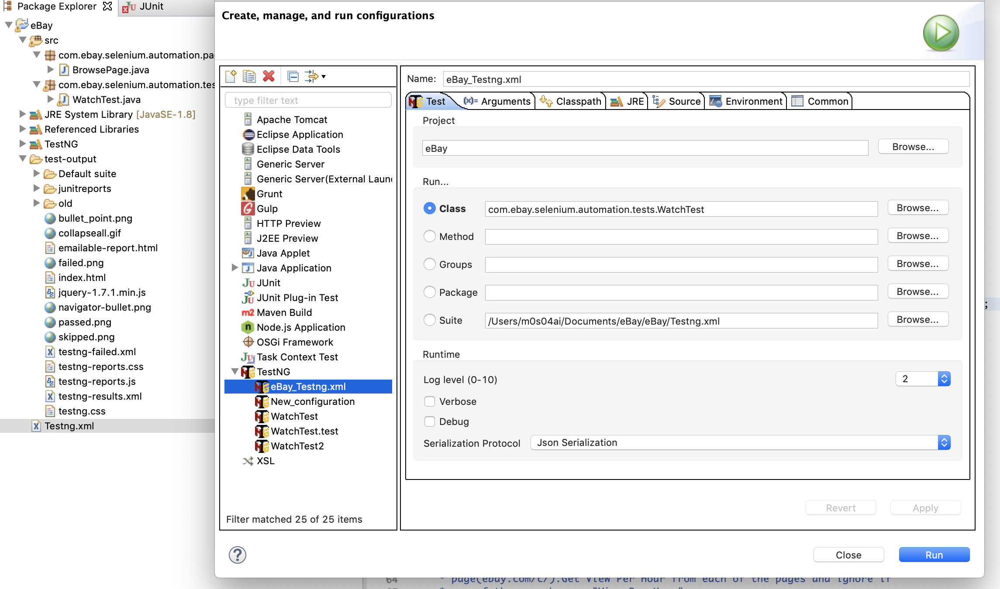
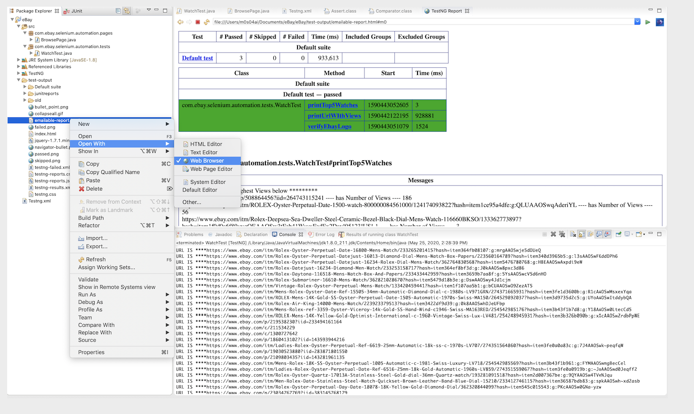

## Selenium Webdriver Test for eBay Watch View

##### SetUp:

1.  Download ChromeDriver from and make sure your chromw version is compatible with teh chromedriver
    https://chromedriver.chromium.org/downloads
2. SetUp TestNG  Eclipse plug-in
   https://www.seleniumeasy.com/testng-tutorials/how-to-install-testng-step-by-step
3. Once TestNg is installed Rightclick->ProjectBuildPath->Add Library->TestNG and finish  
   
   

4.  Run Tests 2 ways
    - Rightclick on Test file(WatchTest.java) and RunAs TestNG
    - TestNG.xml->RightClick->RunAs->Run Configuration -> Select the Class(Browse to the class) -> Apply -> Run
       Also you can entire package/method/suite etc.
    
    
       
       OR
       
     
    
5.    Once TestRun completes it will create test report under test-output folder . To check the report open      

   

