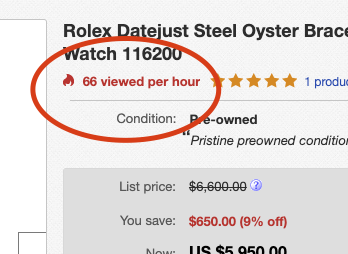

## Selenium Webdriver Test for eBay Watch View

## SetUp:

#### PreStep:  Download selenium Java Language from https://www.selenium.dev/downloads/
  
#### Follow the below steps to Write & Run Tests

1.  Download ChromeDriver from below link and make sure your chrome version is compatible with the chromedriver
    https://chromedriver.chromium.org/downloads
2. SetUp TestNG  Eclipse plug-in ro run tests
   https://www.seleniumeasy.com/testng-tutorials/how-to-install-testng-step-by-step
3. Once TestNg is installed Rightclick->ProjectBuildPath->Add Library->TestNG and finish  
   
   

4.  Run Tests in 2 ways
    - Rightclick on Test file(WatchTest.java) and RunAs TestNG  
    - TestNG.xml->RightClick->RunAs->Run Configuration -> Select the Class(Browse to the class) -> Apply -> Run
       Also you can run the  entire package/method/suite etc by selecting and browing to the respective selection
    
    
       
       OR
       
     
    
5.    Once TestRun completes it will create test report under test-output folder . To check the report open                            emailable-report.html or  index.html Open With -> Web Browser    

   
   
   #### Little details about the Project
   
   Starting on the ebay category page for Rolex watches (https://www.ebay.com/b/Rolex-Wristwatches/31387/bn_2989578), please     find the five watches with the most views in the last hour. The number of views can be found on the item page
   
    
    
  #### Project Implementation 
     
    We have 2 waays to do the project 
    1.  Java Project 
    2.  Maven Project
 This project is developed as a JavaProject and Used Page Page Object Model Where Element identifiers are declared with in the Page class .
 
